**第二天（2月26日）：陕西历史博物馆 西安古城墙（双人自行车） 华山脚下**

在抵达西安之前，我和hillway原打算参观过秦始皇兵马俑博物馆，直接去华阴市游览华山。可是，总感觉身体十分疲惫，便回到市区休息，决定等待体力稍微恢复了再做决定。

就这样，在市区西门的七天酒店里昏昏沉沉睡了一夜，虽然房间隔音效果很差，晚上倒也安静，早上七点半钟被闹钟叫醒。在西安的第二天，游览计划是陕西历史博物馆（上午）和西安古城墙（下午），再去火车站东广场乘车去华山脚下住宿。我和hillway不打算午休，也不想让行程匆匆忙忙，便将行李收拾好，在前台办理了退房手续。为了减轻负担，又将两个双肩包寄存在酒店里。

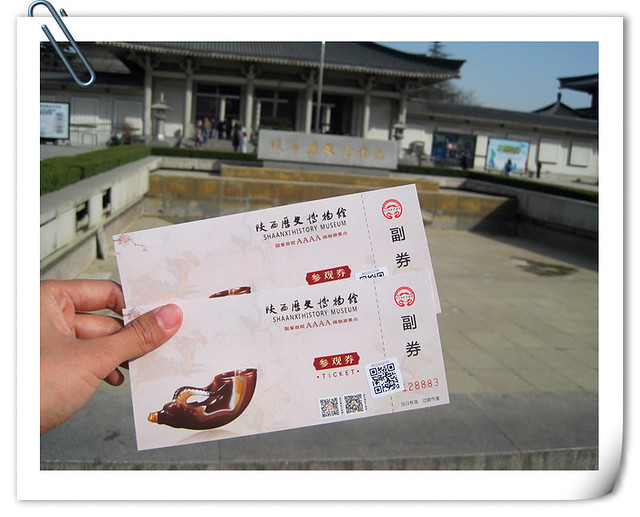

出发前，首先要寻觅吃早餐的饭馆填饱肚子。离酒店不远处有一家子午路张记肉夹馍店，一想到“肉夹馍”三个字，肚子里的馋虫就不安分啦。我们点了两个腊汁肉夹馍，每个8元，秦镇凉皮6元，共计22元。hillway本想早上吃完米粥，因为我不愿意吃，他也气鼓鼓的不要了。而我不愿意吃米粥的原因，是吃过后总觉得肚子难受，有一种早孕时期那种恶心想呕吐的感觉。

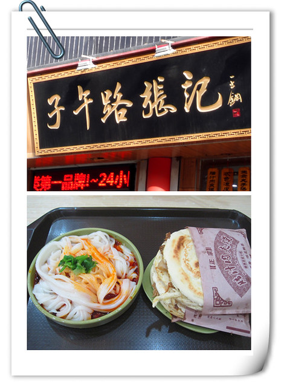

从西门站到陕西历史博物馆没有直达的公交车，出行全指望着hillway的手机导航，东拐西拐来到了陕西历史博物馆的大门。这里施行的是“免费不免票”的原则，凭身份证领取门票后可免费参观，不过珍宝馆和唐代壁画珍品馆需要另外收费。另外，需要注意的是，通常每个博物馆都有闭馆时间，要提前了解清楚，不然扑一场空，浪费了时间和精力。

之前在网上看攻略，很多网友说排队领票的游客很多，不由有些小担心。我和hillway大约十点钟抵达的时候，取票处前只有三五个人，估计是并非周末和节假日的缘故，我们很快就领到了门票。

“给我一天，还你万年”是网友对陕西历史博物馆的精妙概括，也让我燃起了无限参观的兴趣。据介绍，这里的馆藏文物多达37 万余件，上起远古人类初始阶段使用的简单石器，下至1840年前社会生活中的各类器物，时间跨度长达一百多万年，涵盖了壁画、金银器、青铜器、陶瓷器、玉器等类别。

看多了各种年代、材质和形状的器皿，我最感兴趣的是就是唐代仕女的彩绘陶俑。这种下巴和脖子连成一处，胸部和肚子融为一体的身材，目测至少有200斤吧。虽然是个大胖妞，但是仔细看久了，也觉得很美。hillway说：“物以稀为贵，以前古代生活水平低下，物资比较匮乏，能把自己养这样胖，也不是人人都可以做到的。”

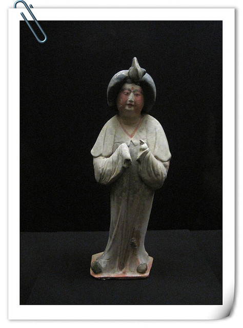

这个三彩载乐驼，堪称国宝级文物，是典型的盛唐时期的作品，驼背上的舞乐者穿着汉族衣冠，手中拿的却是西域乐器，反映了当时文化融合的景象。虽然年代久远，釉色依旧鲜明亮丽，舞乐者的形态也十分逼真传神，体态也很丰润。在流连于唐代仕女彩绘陶俑区域时，渐渐产生了一种安慰感——虽然近段时间体重几乎飚至130斤，但相比之下也没有胖的很厉害哦~

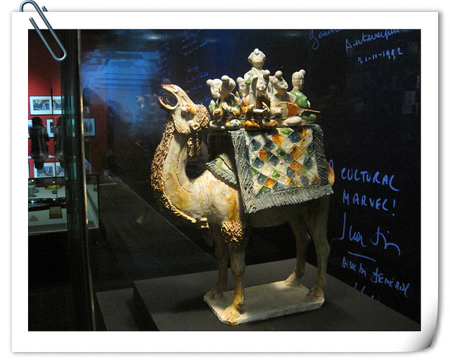

在历代陶俑区，我们又看到了很多秦始皇兵马俑。在这里近距离观看，比在秦始皇兵马俑博物馆一号坑的围栏外看的更加真切。

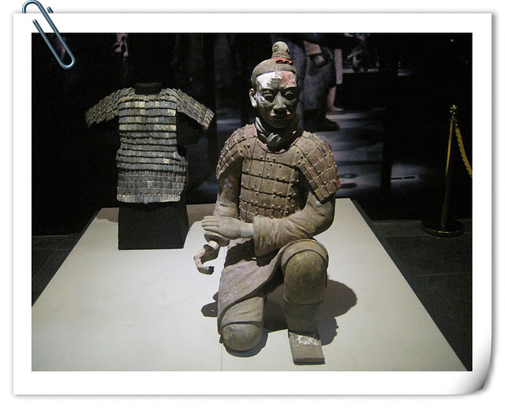

隔着玻璃，可以清晰的看出秦始皇兵马俑破碎和修复的痕迹。

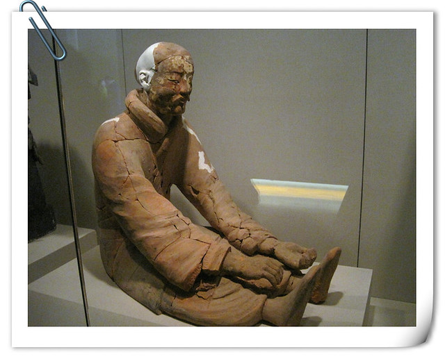

秦始皇兵马俑虽说“千人千面”，但都是单眼皮的男人，而且小腹都有些微凸。

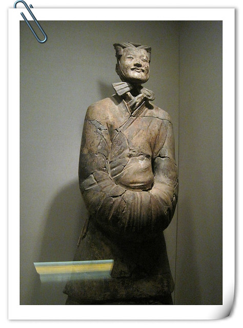

忽然在灯光昏暗的房间里，看到整屏幕的秦始皇兵马俑的人脸像，被吓了一跳。看来考古这项工作，也非人人都敢去从事的。

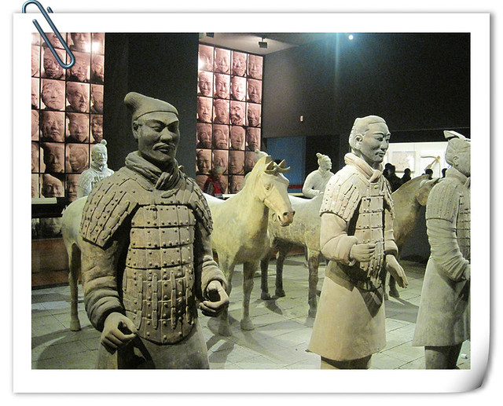

除了秦始皇兵马俑，这里还有汉、北朝、隋、唐和宋、元、明、清等朝代的陶俑，质地有陶、彩绘陶、釉陶和三彩等，艺术形象有文武官员、甲士侍卫、男仆女侍、西域胡人，以及天王、镇墓兽和马、骆驼等各种动物。在数量和体积方面，仍旧当属秦始皇兵马俑最具气势。

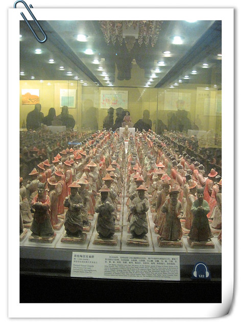

博物馆通常灯光昏暗，又很安静，不由让人有种压抑感。加之空气干燥而又闷热，总让人感觉呼吸不畅，比较疲乏。尽管睡了十几个小时，我和hillway每参观一个展馆都要在门外的长凳下休息一段时间，逛着逛着就有一种走不动路又很口渴的感觉。出门后，我们便将随身携带的两盒纯牛奶一饮而尽了。

午饭是hillway用手机在附近团购的歧风烙面皮，砂锅土豆粉、米皮、肉夹馍和两杯可乐，共计22.7元。这一家的肉夹馍比较脆，一口咬下去就会掉渣渣。

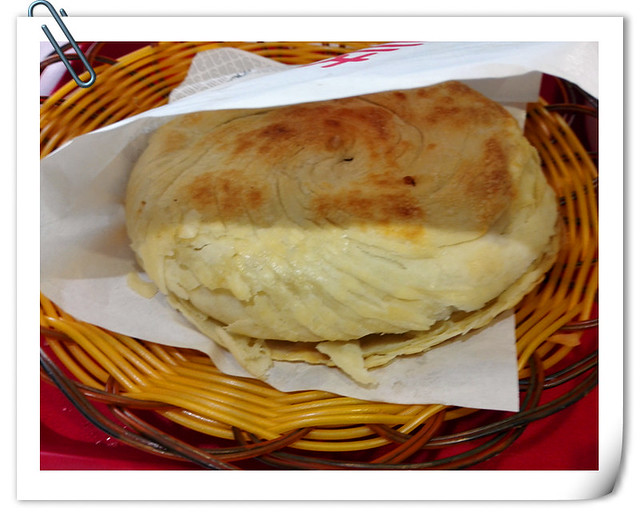

凉皮微辣，有一些酸，吃不习惯，给hillway吃了。

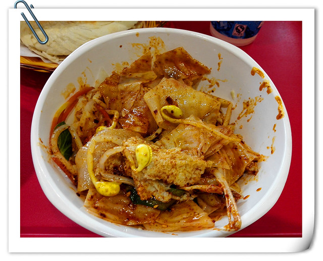

虽然砂锅土豆粉的配料比较多，还有一根麻花，但吃起来总没有开封那家的美味。其实肚子并不怎么饿，关键是总觉得很渴，临走时，又在店里买了一杯雪碧，3元。

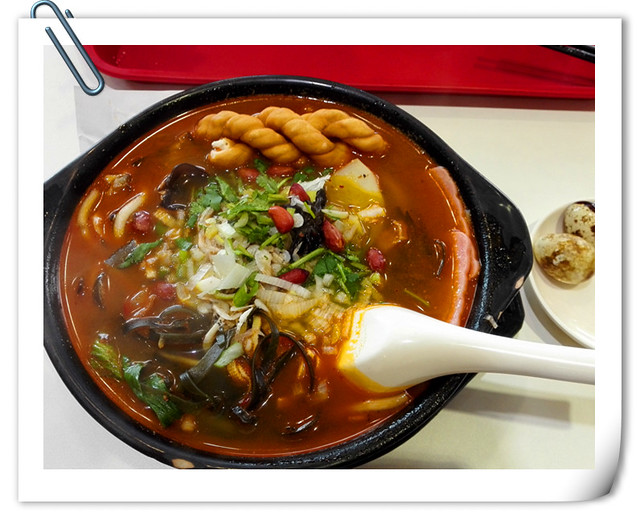

吃过午饭，我和hillway乘公交车返回西门站。西安的公交车站牌有个特点，就是同一个站名，有时候确是不同的地方，一站路的距离也很远，有时候没有搞清楚情况下了车，要走很远的路。

下午时间，我们准备到西安古城墙上看一看。登城墙之前，hillway在附近的便利店里买了一大瓶矿泉水，4元，以备口渴。西安古城墙的门票是每人54元，虽然正值淡季，但总觉得西安的景点门票收费比较高。

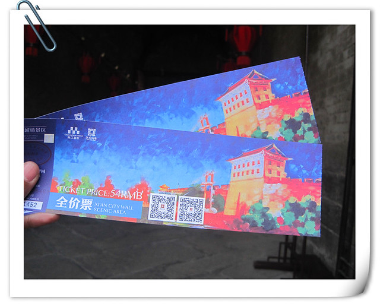

刚刚登上古城墙，我和hillway还是蛮兴奋的，拿着相机拍了很多的照片。忽然发现，只有当我和hillway单独外出游玩的时候，相机里才会有我们两人单独的大量照片。平时带着小熊仔，我们几乎很少拍自己，手机和相机里全是她。

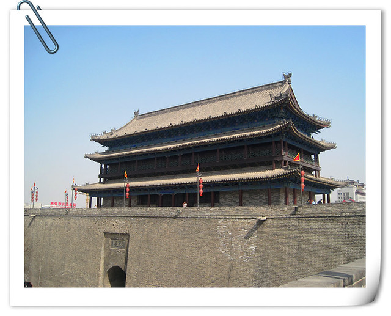

拍够了照片，在我的强烈提议下，拉着hillway到城墙租车处。在之前翻看旅游攻略的时候，早早就打算着要在西安古城墙上和hillway一起骑单车，慢慢感受下两个人的恬静时光，尽管平时很抠门，还是狠下心来租了一辆双人自行车，收费为两小时90元，押金100元。hillway和我一样，从来买有骑过双人自行车，也很激动和高兴。

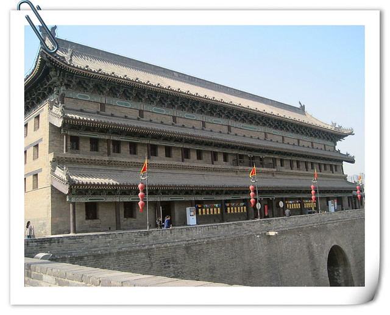

在每个城楼之间，是一条长长宽宽的路，间隔一段悬挂着红灯笼。我和hillway每骑一段路，就会停下来互相拍照，或是将相机设置为连续自拍，放在城墙上，拍我们一起骑单车的合影，效果也很不错。在拍照和骑车之余，我们也时不时从城墙往下看西安城，不过沿路房屋建筑都比较普通，估计晚上灯光亮起的时候，夜景会比较好看一些。

在骑车的过程中，发现有些地方的路面并不平坦，颠簸的厉害，感觉屁股被硌的越来越疼，特别是赶着回到西门城墙的那段路，屁股真是遭了罪了。

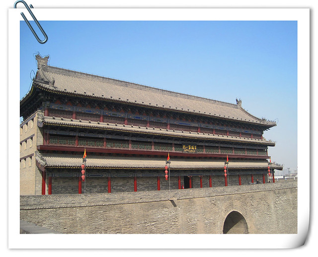

骑着骑着，我们忽然看到了西安火车站，远远望向东广场，仔细观察看见发往华山的汽车还停在那里。hillway说：“第一天来西安的时候，刚出火车站看到这堵城墙，还以为是仿造的，原来和古城墙是连成一处的。”

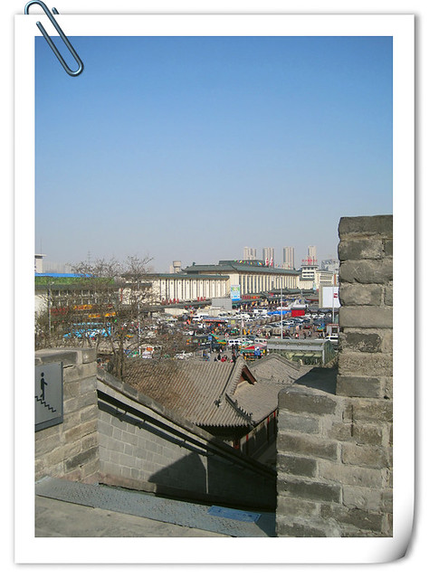

古城墙的南门有大型灯盏，造型新颖，很有创意和艺术感，沿路还有售卖旅游纪念品和小吃的摊位，我和hillway驻足观看拍照，耽误了一些时间。看着归还自行车的时间临近，我和hillway一路用力蹬车，刚好在两个小时的时候抵达了古城墙西门，取回了租车押金。估计工作人员规定两个小时的租车时间经过“实际演练”的，这个时间刚好够游客不紧不慢围着古城墙骑行一圈，若是单靠步行的话，估计要大半天的时间了。

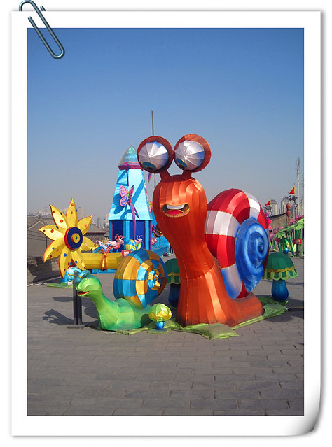

从古城墙西门下来，我们到附近的沃尔玛超市买了桶面、八宝粥、面包和士力架等食品，约42元，以备第三天爬华山用。在等公交车的时候，hillway去酒店取回了我们俩人的双肩包。

西安火车站东广场有发往华山玉泉院的大巴车，单程36元每人，若买往返票则是60元每人，九天内有效。我和hillway上车后买了两张往返票，共计120元，等到傍晚六点二十分全车满座后，司机便发车了。

晚上八点半左右，司机将大巴车停在了玉泉路上某家饭店门口，告诉我们进店可以听免费讲解。hillway觉得饭店老板的免费讲解肯定别有用意，可我又很想听一听关于爬山的讲解，便抱着万分谨慎的态度进了饭店。正对着店门的墙上悬挂着一整张华山的登山图，老板拿出伸缩指挥棒给我们讲解了半夜登山看日出和清晨登山两种登山路线，最后着重强调游览华山时，安全永远是第一位的，感觉体力不支或是危险的地方，风景少看几眼没有关系，一定要平平安安回家去。由此看来，饭店老板虽有招揽生意的目的，但是也很随意，免费讲解后并没有任何强制消费。

常听人介绍华山是以“险”著称，登山时要手脚并用，有一些楼梯坡度十分陡峭，每年都有伤亡事故发生……因此，心里总是有些担心和忐忑，还有许多疑问，比如不知道将华山五峰全部游览一遍需要多长时间？晚上能否顺利下山？……

在乘坐大巴山的时候，hillway在网上团购了玉泉路九州宾馆的大床房，67元一晚。现在正值淡季，整个宾馆感觉比较冷清。宾馆老板态度很热心，赠送登山手套（攀爬铁链很冰）和登山地图。在车上，我和hillway吃了一些面包和八宝粥，感觉肚子并不怎么饿，在宾馆又泡了桶面吃下。我和hillway住的房间除了一张大床房，还有一张单人床，空调、热水器、电视和一次性洗漱用品等都很齐全，出乎意料的是还有一台很新的台式电脑，网速很快。美中不足的是，可能是房间面积太大，山里温度比较低，我们开着暖风，仍旧感觉有些冷，把临床的被子抱过来一起盖在身上总算暖和一些了。

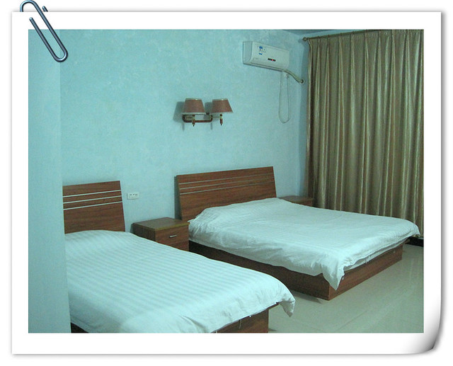
