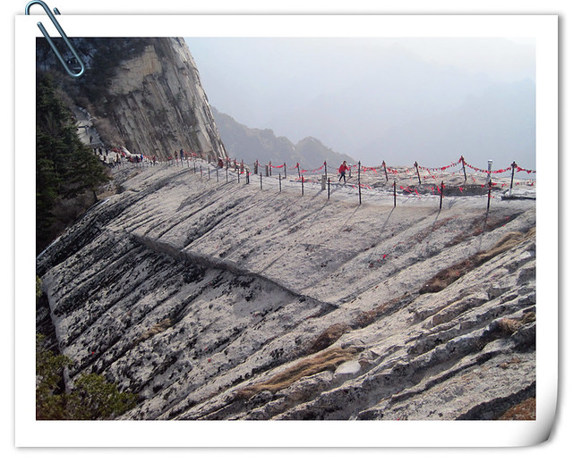

**第三天（2月27日）：华山（西峰索道）**

华山位于陕西渭南华阴市，以险著称，自古就有“奇险天下第一山”的说法。据介绍，华山南峰海拔达2154.9米，不仅是华山最高峰，也是五岳最高峰。

在游览华山之前，我和hillway阅读了很多的游记，也询问了当地宾馆和饭店老板，根据自身情况，放弃了半夜出发清晨看日出的方法，原因有三点：一是熬夜休息不好，爬山时身体会困乏劳累（来西安时乘坐凌晨一点的火车都已经让我们感到很疲惫了）；二是夜间照明光线不好，本人比较胆小谨慎，怕走夜路，加之顺着台阶向上爬，沿途看不见风景，返程若想观看沿途风景就只能依靠两条腿下山，体力不支；三是hillway曾经在黄山住宿一晚观看过日出，据说人多拥挤，忍冻挨饿，而日出景象一般，已无再看的兴趣。

于是，我和hillway早上六点半起床，叫醒了熟睡中的宾馆老板，hillway感觉有些不好意思，老板说：“没关系，我一晚上要起来几次的。昨天半夜十二点多这里有一批人起床去爬山了，到凌晨五点多的时候，有几名游客爬到一半实在受不了又返回宾馆来了。”我们办理了退房手续，将一个沉甸甸的双肩包和皮鞋寄存在宾馆，由hillway背着一个装着食物和水的双肩包上路了。

为了填饱肚子以备爬山消耗，我们在宾馆对面的潼关肉夹馍店里点了一盘蛋炒饭（12元）、一碗牛肉拉面（15元）和一个腊汁肉夹馍（7元），共计34元。虽然我们点餐后等候了很久，但是也没能等到可口的饭菜，除了肉夹馍味道好一些，其他的都超难吃。蛋炒饭的盘底一层的油，米饭根本没有炒开，还是一些米团，鸡蛋直接整块放在里面，香葱切得很大，完全是生的直接混在饭里，简直是我有生以来吃过的最难吃的蛋炒饭。而牛肉拉面不仅分量小，味道也不好，加之放了食醋，就感觉更加难吃了。

囫囵吃过早饭，大概七点半左右，我们就往华山进发了。

从玉泉路去华山售票处，需要经过玉泉院，我和hillway为了赶时间，就没有慢慢参观玉泉院的景致，直接来到了售票处。现在正值华山景区的淡季（12月1日—次年2月底），门票是100元每人，若是到了旺季（3月1日—11月底），门票就是180元每人啦！这样一算，我们两人提前两天游览，省了160元呢，嘿嘿……

进入华山景区后，首先是一段长长的上坡路，左边是沟壑，右边是山石。hillway一再强调，要慢慢前进保持体力，不求快而求持久。慢慢的，我们被后来的很多游客甩在了身后。

大约十点钟左右，我们结束了走斜坡的道路，开始上台阶。听说越往山上走，物价就越贵，山顶上一杯热水要卖到10元，一碗面售价达70元。在这段位置，矿泉水的标价是十元两瓶。

每走一段路程，我和hillway都会停下来拍照，再拿出宾馆老板赠送的爬山图研究一番，看看到底走了多少路程。走着走着，沿途可看的风景也多了起来。

华山是道教主流全真派圣地，沿途可以看到很多的半悬空洞和道观，其中玉泉院、都龙庙、东道院、镇岳宫被列为全国重点道教宫观。

爬台阶不比走缓坡，特别是坡度比较大的台阶，基本上一口气爬个十几级就感觉很累。我和hillway每上一段台阶，遇到有座椅的地方必会坐下来歇歇脚，而没有座椅的地方，我们便直接坐在台阶上大口喘气，爬山速度慢如蜗牛。

hillway概括我们爬山时的体力为：“充电两分钟，通话三十秒。”

从玉泉院到华山北峰的路途感觉很漫长，从地图上看距离也的确比较远。我们慢慢的经过了五里关、莎萝坪、毛女洞和回心石等景点，来到了传说中的千尺幢。之前走过的那些山路总感觉与他山大同小异，而这处千尺幢让我第一次感受到了华山的独特之处，特别是爬到半途中回头往下看的时候，更觉得比较惊险。

爬上千尺幢，紧接着就是百尺峡。这两处坡度比较陡峭，而且台阶比较窄，有些地方只够小半只脚掌踩在上面。如果说之前那段台阶山路两旁的铁链可用可不用，而这两处则需要手脚并用，拉着铁链往上走，真正称得上是“爬山”。

沿途山壁上，时不时都会看到一些题字，有很多是近代人提的，我和hillway无心“风雅”，未驻足细看，只顾着往前“赶路”。

大概十二点钟，我们终于到达了华山景区的第一个目的地：北峰。从玉泉院到北峰，用时四个半小时。刚开始登山的时候，还有些担心会走错路（饭店老板之前告诫我们，走错一段就要用几个小时返回），结果顺着传说中“自古华山一条路”的线路前进，沿途的指示牌上的标识十分清晰明确，不存在迷路问题，估计是夜晚爬山的游客可能会看不清指示牌吧。

取景较好的区域，自然少不了拍照立等可取的生意人。如今人人都有了相机手机，估计他们的生意也受到不少的冲击吧。即便如此，他们招揽生意时仍旧信心满满，冲着正在拍照的我和hillway喊着：“虽然站在同一个地方，你们拍的脸肯定是黑的，没有我拍的好看。”若是背着阳光拍照，光线自然不好，自己换个角度，效果就好了。

我和hillway爬山时随身携带的斜挎包和双肩包里，除了相机、备用电池、手机和抽纸，还有一盒纯牛奶、一瓶矿泉水、两盒桶面、两个苹果，以及若干法式软面包和大面包、热狗肠、士力架和大白兔奶糖。

到达北峰，我们找一处小亭子坐下来歇脚，hillway提议“开饭”，而我并不觉得肚子饿，一路上吃了两个苹果，一小口一小口抿光了一瓶矿泉水（不建议喝太多水，沿路卫生间比较少，如厕不便）。hillway说：“这里正好有歇脚的平地，往前走全是上山的台阶路，到时候没有地方可以坐着吃东西了。”于是，我们吃了一些面包和热狗肠，士力架实在是太黏太甜了，吃了几口感觉齁的厉害，都给hillway吃了。

吃过“午饭”，我们便顺着擦耳崖继续往东峰进发。

时间正值晌午，看到有一些游客乘坐缆车也来到了北峰，其中还有带幼童爬山的游客，我和hillway在体验了带小孩游玩的滋味后，都很佩服那些家长的精力和耐心。

若是目光一直朝着道路前方看，顺着台阶往上，走着走着，倒不觉得华山有多险峻。但是，若是伸头往两边的山谷看，或是回头看看来时的路，仍旧感觉有些惊险刺激，也小有成就感。

华山虽然有些险，自己多加小心就能够平平安安。我和hillway反复强调着：上台阶的时候要拉着铁链，专心走路。若是要看风景或是拍照，就停下来找一处安全位置站好，千万不能三心二用。

走过苍龙岭，走过金锁关，大约两点半钟，我们到达了东峰的观景台。

虽然攀爬比较陡峭的台阶有些累，但坐下歇息一会儿，感觉体力马上又回来了，继续开始上路，估计是山上空气清新呼吸顺畅的缘故吧，整个人被山风吹的神清气爽，反倒还没有前两天去秦始皇兵马俑博物馆和山西历史博物馆那般疲惫不堪。

不仅如此，整个爬山过程中，我和hillway并没有明显感到肚子饿或口渴。于是，我问hillway：“你知道为什么我们肚子不饿吗？”hillway摇摇头，我继续说：“我觉得是因为山上的风很大，一直往嘴巴里吹，山风把我们的肚子给撑饱了，看来喝西北风这句话还是有些道理了哦~哈哈哈……”

时隔四年回老家过年，很遗憾没能遇到降雪。在爬华山的途中，我们渐渐看到了未曾融化的积雪，特别是接近山顶的位置，积雪的面积更大，hillway显得很兴奋，拿起一团雪在手上，主动让我给他和雪景拍照。

二月底的山风吹在身上并不觉得冷，爬山的过程中还略微出汗。而当我们到达南峰，跟着hillway登上摆放着“国务院批准重要地理信息数据华山（南峰）高程2154.90米”的平台时，感觉风力很大，让我有些不敢站立，紧紧抓住铁链（上面挂满了金锁），更不敢像其他游客那样靠近拍照合影了。

hillway站在平台上朝着我大笑，一是嘲笑我太胆小不敢上前，二是嘲笑我两手紧紧抓住的金锁上面写着大大的“求子锁区”的字样。

在爬华山之前，心里总是有些担心和不安，害怕有些地方自己不敢走，要打退堂鼓。一路登山后才知道，原来比较惊险的鹞子翻身、长空栈道和云梯并非上山必经之路，而是自愿出钱体验项目。华山山势险峻，提供给游客攀登的山路只要拉紧铁链，小心脚下，还是挺安全的。

下午四点十分左右，我和hillway到达西峰。从早上七点半登山到西峰（未去中峰），一共用了九个小时的时间。我和hillway估算了一下，若是再步行下山，估计到半夜才能返回玉泉路了，而且体力耗费太大，影响后两天的游玩，因此决定乘坐西峰索道下山。

距离西峰索道关闭还有一段时间，我们决定到西峰顶上看一看。可是，刚走几步我就不敢往前走了，去西峰顶的这段路四周没有任何遮挡，山风特别大，虽然抓着铁链，但是根本站不稳，感觉要被吹到山谷里去了。于是，我小心翼翼半蹲着原路返回，让hillway一人去体验西峰山顶的风景。

hillway慢慢走远，我留在西峰索道的岔路口等待。大概过了十分钟左右，我踮起脚尖网上看，怎么也看不到hillway返回的身影，开始为他担心起来，身边有一名带小孩的韩国人也在焦急等待着。

又过了一会儿，终于远远看到了hillway小小的身影，他看见我给他拍照，很高兴的挥手冲我打着招呼。hillway告诉我，西峰顶上的风的确很大，有些地方他也不敢靠近。

在爬华山之前，我爬过的山海拔都不高，比如信阳鸡公山、金华尖峰山、广州白云山和厦门南普陀，还有汕头的龙泉岩和礐石风景区，总觉得经过开发的山与山之间没有太多的差别，比较千山一律。而这一次登临华山，让我感觉到不虚此行，真正值回了百元票价，险峻的山峰开阔了眼界，也增加了一段不一样的人生体验。

四点半左右，我和hillway来到西峰索道售票处，淡季费用是每人120元。乘坐索道之前，工作人员把我们领到一处悬挂着华山风景的屏幕前拍照，告诉我们是乘索道免费赠送的，到下山处可以领取。

hillway比我的胆子大，而且他之前去黄山游玩乘坐了两次索道，所以比较淡定。而恐高又胆小的我刚开始坐在悬挂的缆车上，总是感到恐惧，十分害怕，闭着眼睛根本不敢往外看，感觉到山风把缆车吹着摇摇晃晃。

hillway坐在靠门的位置上，用相机拍了一些华山风景的照片后，又开始纠结着晚饭吃什么，到哪里吃的问题。而我的大脑里除了害怕还是害怕，只求时间快点走，快点到达山下。

缆车大概用了四十分钟的时间，终于停下来了。出口处，这里的工作人员告诉我们，刚才在山上拍的小书签是免费的，但是照片需要另出20元购买。hillway觉得给他拍的不够帅，就没有出钱买，我拿着小书签走了。

本以来缆车停下的位置离玉泉院很近，后来用手机搜索才发现原来停在了一个前不着村后不着店的地方，所有游客都必须乘坐每人40元票价的汽车才能返回玉泉路或游客中心（前半段都是盘山公路）。相比我们从西安市区到华山脚下这段30元的票价，感觉收费有些太高了。乘车途中，hillway仍旧用手机不停地搜素着晚上吃饭和住宿的问题，并不停地纠结着询问我的意见。

返回玉泉路后，我们在附近的香禾缘米线店里吃的晚饭，点了一份咖喱鸡腿饭，一份面皮和一个腊汁肉夹馍，共计26元。后来感觉口渴，又买了一瓶雪碧，3元。看来，华山脚下的物件和市区差不多，并没有想象中的那种景区高消费。

吃过晚饭，我去前一晚的宾馆里取回了我们的双肩包和皮鞋，到了斜对面一家hillway在网上团购的宾馆，49元每晚。我们提着双肩包走过去一看，原来就是吃早餐的那一家。

前台老板直接告诉我们，他感觉49元没有什么利润可赚，直接拒单了，后来似乎感觉不妥，又说带我们先看看房间，若是满意再住。宾馆条件比较简陋，和大学门口农民自建房开的宾馆差不多，虽然我感觉前一晚住宿环境不错，但hillway总觉得房间有些冷，不愿意再住同一家。我也没有太多住宿要求，能够睡上一觉歇息一晚就够了，于是老板不得已答应下来，让我们在一楼饭店等待他的家人收拾房间。我感觉很纳闷，既然感觉团购价钱不划算，那干嘛自己要在网购搞团购，然后又要拒单？又反复和我们强调，因为房价太过“便宜”，就不要开空调取暖了，换用电热毯效果会更好，又强调一定要给五分好评之类……

hillway十分不喜欢这家店的老板，觉得他满肚子花花肠子，太过油滑，“你看他把宾馆取名也叫如家，人家点菜他总是说这也没有那也没有，转弯抹角让人家点一堆他推荐的菜，油嘴滑舌的，估计开店前也外面游混过几年，没一句是真诚的话……”等待了将近半个小时，终于把房间收拾好了，本来想洗个热水澡，发现既没有现成的热水，也没有提供洗发液，又等待了一个多小时……我们把电热毯打开，确实不觉得冷了，不过这里的床板实在太硬了，硌的人有些背疼……由于hillway对老板的厌恶和对宾馆条件的不满，因此，感觉到美好的登山旅游的结尾并不是很愉快。
