**第五天（2月29日）：钟楼 鼓楼 青龙寺 回坊风情街 西安火车站**

在西安的最后一天，我和hillway主要旅行目的地是靠近酒店的钟鼓楼和回坊风情街。

早晨醒来，首先要解决早饭问题。出门前本来在房间里团购了一家早餐，发现新世界百货商场并未开门，便跟着hillway来到了传说中的回坊风情街。派酒店钟楼店距离回坊风情街很近，步行也就是三五分钟的路程。早上的回坊风情街有一些商店陆陆续续开门，但还是很冷清，游客也很少，估计到了中午之后特别是晚上才会热闹喧嚣起来吧。

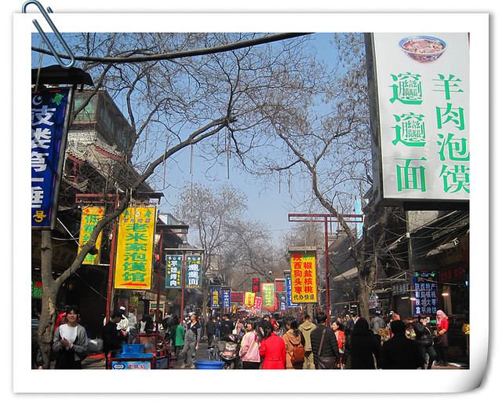

磨磨蹭蹭到了上午九点钟，我们在回坊风情街徘徊了一大圈，看到一家卖肉丸胡辣汤的小摊位上有几个食客在用餐，便跟着点了两小碗胡辣汤（5元一碗），hillway担心吃不饱，又买了一个菜夹馍（3.5元一个），共计13.5元。<!--more-->

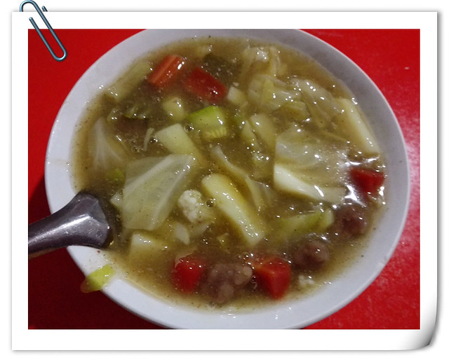

这种胡辣汤我们是第一次吃到，里面有很多种类的蔬菜，比如包菜、土豆、花菜、西葫芦和豇豆，虽然是清真肉丸胡辣汤，但是吃起来并没有什么肉，更像是肉色的面疙瘩，放了胡椒和花椒，还有一点偏咸。而菜夹馍有些像在郑州吃的布袋馍，不过里面夹的豆芽海带之类的菜都是凉的，有一点点辣和咸。

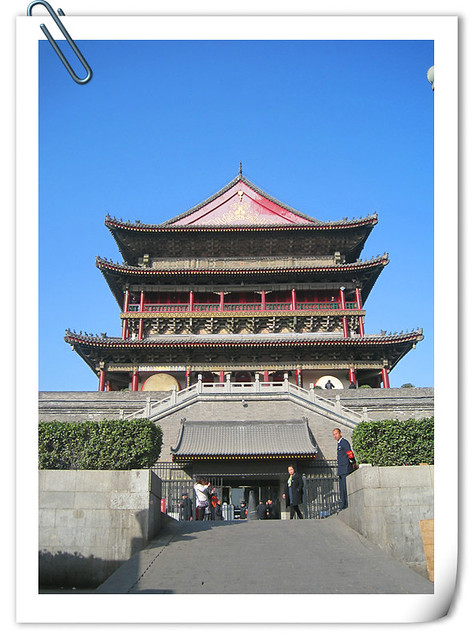

吃过早饭，hillway带着我继续往前走，到达了鼓楼的位置。

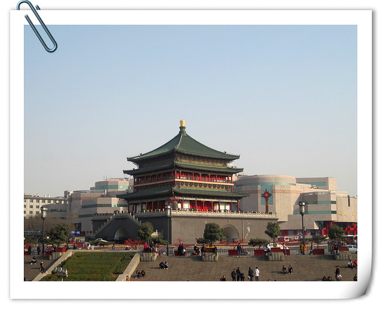

钟楼距离鼓楼很近，不过被马路包围住，只能远观。

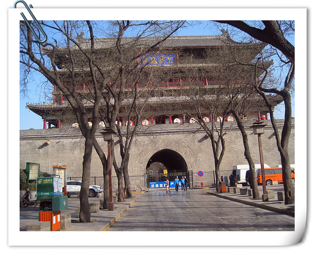

我和hillway仍旧感觉买门票登楼的意义不大，就围着鼓楼看风景。印象中记得攻略上写的钟鼓楼有表演，和hillway等到十点多钟，可是一点动静也没有（估计是在城楼里面表演）。

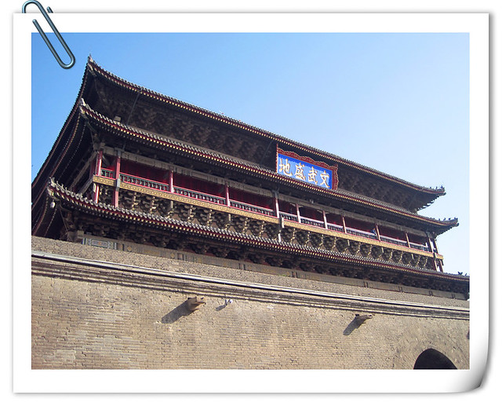

逛过了钟鼓楼，我们打算沿着大马路返回酒店，一起逛了逛沿路的民生百货商场和新世界百货广场，里面除了售货员之外，只有我和hillway两名顾客，整个商场显得十分冷清和空荡。

看到公交站牌前行色匆匆快步疾走的年轻人，再看看悠悠闲闲的我和hillway，总觉得有些不协调和不自在，“你看人家都忙着上班赚钱，我们俩个人大老远的却跑到西安花钱来了，哎，都想回去工作了。”hillway说：“既然大老远来了就好好玩一玩，你之前不是一直想来西安吗？等回到汕头要生二胎，起码有两年不能出远门旅游了，好好珍惜吧。”

回酒店后，感觉有些头晕，便又休息了一会儿，睡醒后洗澡收拾好行李，便去前台办理了退房手续，仍旧将两个双肩包寄存在酒店里，只携带了一个轻便的斜挂包。

虽然人生地不熟，但是手握一部智能手机就可以解决很多问题。不仅可以查询到很多的交通信息，还可以预定酒店，团购当地美食，不仅方便还可以节省银子。在西安，我和hillway几乎每一顿饭都是都是用手机app购买的团购餐。思量着来到西安还没有品尝到著名的羊肉泡馍，便将午饭选择在西羊市40号老孙家泡馍店。

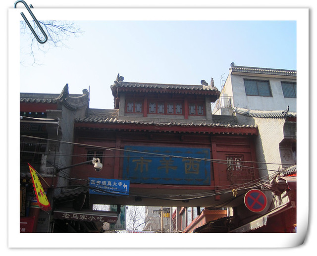

在回坊风情街寻找老孙家泡馍的时候发现，这里有很多店都叫老孙家，除了遍地开花的老孙家，还有很多的老米家和贾二贾三家，所有饭店和商店售卖的美食和旅游纪念品也彼此互相重复。虽然店名重复的很多，但是西羊市40号的门牌号只有一家，找到准没错。

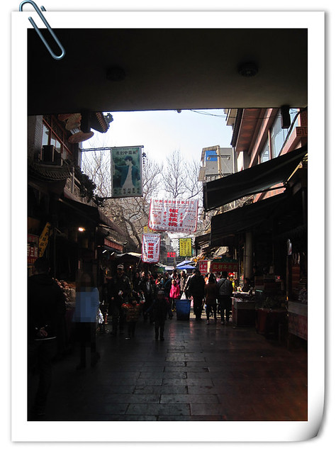

主要针对外地游客消费的回坊风情街，商品售价自然也不会实惠到哪里去。在这里，一碗羊肉泡馍的标价普遍在25—45元之间。但是网上团购就不一样啦，一碗羊肉泡馍9.8元，一份炒馍10.8元，各配一杯酸梅汤还有糖蒜，共计只要20.6元，比店里标价要便宜很多很多。

虽然西羊市的巷子看上去很窄很破旧，但是这家泡馍店的装修还是让我感觉有些意外，再想想我们的团购餐的价钱，就感觉更加超值了。

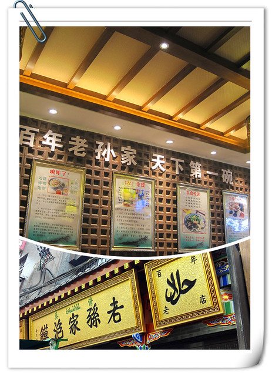

前台小妹验证成功后，递给我两大碗小馍块儿，让我再找店小二拿去制作，这种特别的点餐方式还是第一次遇到。

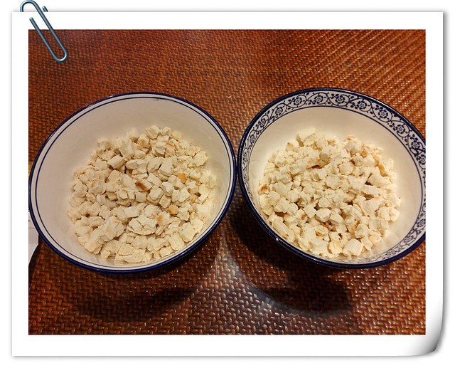

等候片刻，两碗香喷喷的羊肉泡馍/炒馍就端上来啦。

羊肉泡馍很好吃，口味偏淡，不过炒馍就比较重口味了，比较辣比较咸，又很酸很酸。邻桌有位当地口音的大姐也在吃炒馍，竟然还觉得味道不够，又找店小二要了一叠红彤彤的“辣子”，全部倒进碗里去了，看来陕西人吃辣一点也不输给湖南、四川人呀。

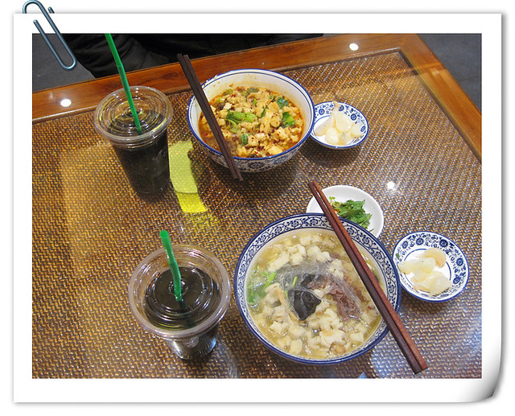

酸梅汤实在是酸呀，喝过一口之后，还要缓一段时间才能继续喝下第二口，午饭消灭干净后，我和hillway的两大杯酸梅汤几乎还是满的，于是便拿在手上慢慢走着，一边看回坊风情街的叫卖红柳烤串的小伙和肉夹馍摊位前排起的长龙，一边小口小口的喝。

填饱了肚子，我和hillway又发愁起来。因为在尚未动身来西安之前，我们已经买好了返程的火车票，距离晚上十点钟的火车还有九个小时左右的时间。钟鼓楼的风景已经领略过了，回坊风情街主要用来解决吃饭问题，剩下的大把时间要去哪里？于是，又重新翻出之前打印的西安旅游攻略看了起来。

在西安的五天时间里，我们已经游览过秦始皇兵马俑博物馆、秦始皇帝陵遗址公园（丽山）、陕西历史博物馆、西安古城墙、华山、玉泉院、大雁塔广场、鼓楼、钟楼和回坊风情街，品尝过了西安腊汁肉夹馍、羊肉泡馍、炒馍、岐山臊子面、biangbiang面、岐山烙面皮、陕西凉皮和清真肉丸胡辣汤。我和hillway在攻略中搜索着还未曾去过的地方，从华清宫、大唐芙蓉园、西安碑林博物馆、小雁塔、大明宫国家遗址公园、青龙寺、翠华山、碑林书画一条街、曲江海洋世界、西安未央湖游乐园等西安景点中，选择出两个比较有特色和感兴趣的地方：大明宫国家遗址公园和青龙寺。

hillway用手机查询到从回坊风情街到大明宫国家遗址公园乘车不太方便，距离较远，便坐上开往青龙寺的公交车，似乎距离市区也很远，感觉在车上坐了很久，开到了城郊。

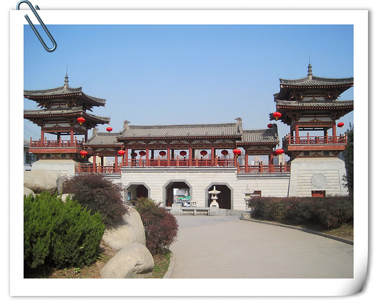

青龙寺，又名石佛寺，中国佛教密宗寺院。青龙寺初创于隋开皇二年（公元582年），当时称灵感寺。原青龙寺在北宋元祐元年（公园1086年）后废毁，地面建筑荡然无存，殿宇遗址被埋没地下。

建国后，青龙寺遗址经考古调查发掘，兴建了乐游原遗址公园。在原址上建立的青龙寺寺庙区及青龙寺遗址保护中心与普通寺庙建筑风格不同，更像是唐代的江南园林，十分幽静古雅。

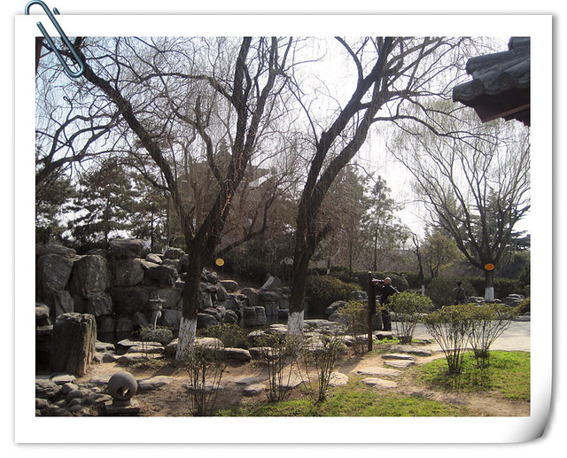

青龙寺地处地势高峻、风景幽雅的乐游原上，极盛于唐代中期。当时有不少外国僧人在此学习，尤其是日本僧侣，因此青龙寺是日本人心目中的圣寺，是日本佛教真言宗的祖庭。寺分东西两处，有日本捐资修建的大型仿唐建筑——“惠果、空海纪念堂”，及青龙寺出土文物展室等，是许多日本游客神往的观光胜地。

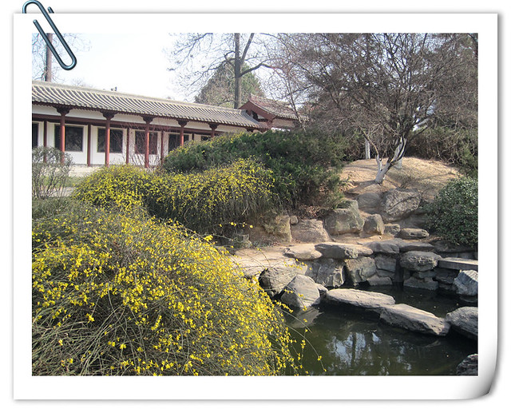

1986年，青龙寺从日本引进千余株樱花树植于寺院，每年三至五月间，樱花盛开，春色满园，另外还有牡丹、芍药、郁金香等花卉展出。只可惜现在是二月底，有一些樱花树仅开出一个个小花苞，没有办法看到樱花盛开的景象了，因此园里的游客也很稀少。

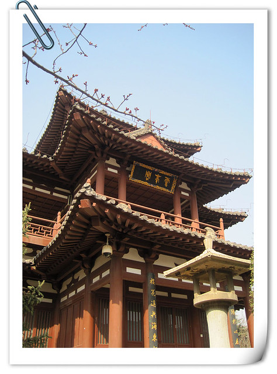

青龙寺遗址保护区之外的乐游原遗址公园建筑也模仿着唐代楼宇风格，和大唐不夜城相比，这里更让我有一种梦回唐朝的感觉。除了目之所见的几处仿唐建筑，广场略显冷清空旷，有一处小小的儿童游乐设施，我和hillway在阴凉处坐了一会儿，便乘公交车回去了。

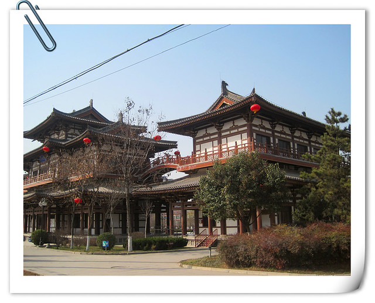

在钟楼附近下车后，我和hillway无事可做，便去附近的开元商场里逛一逛，在优衣库里试穿了几件衣服，在无印良品店里感叹下标价之高，便打开手机团购了附近的东东包双人餐，34元。

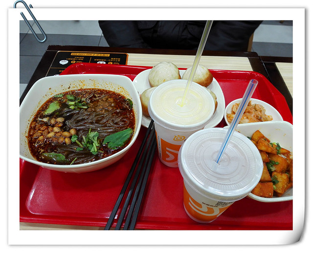

这里的东东包双人餐仍旧没有任何炒饭，店长建议换成同等价位的牛肉拉面，饮料要的是玉米汁和奶茶，喝起来很甜很香，估计含有一定的添加剂吧，煎包像是之前卖剩下又重新下锅煎热的，很多油进到了面里面，口感很不好，油炸土豆应该也是剩的重新下锅炸过，完全没有前一天中午吃到的美味，对东东包的印象一下子也不好了。

吃过晚饭，我和hillway继续在回坊风情街一带慢慢游逛。夜色中的钟楼在灯光的点缀下比白天更多添一分绚丽。

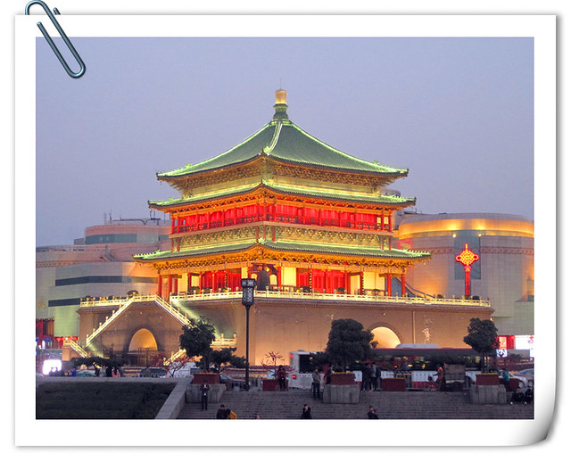

在开封旅游时，在南宋御街的一家店铺中看到一只陶瓷小鸟，装水后可以吹出类似小鸟的叫声，小蜜瓜说她小时候玩过，很想买一个给小熊仔玩，当时错过了没有买成，有些遗憾。我心里面一直记着这件事情，在西安的这几天，一看见有卖旅游纪念品的店铺，就拉着hillway一起特别留意找一找，终于在鼓楼附近的一家茶具店门口找到了，买下后（5元一个）用抽纸包起来放进斜挎包里。

刚开始以为回坊风情街只有短短一段路，走进西羊市发现东西南北都延伸出很多条小巷子，售卖着各种小吃，若不是hillway在前面带路，估计我一个人真的会迷路了。hillway说：“虽然这些小商店和小吃店都卖着相互重复的东西，但有些东西还真的是没有见过，在这里慢慢悠悠逛着也感觉很好玩。记得上次一个人去逛上海的城隍庙，凄风冷雨的，别提有多无聊了，要是当时你和我在一起就有意思了。”

我们路过一家卖串串香的小店，看到很多年轻人和小情侣围坐在街边的小桌子吃的热火朝天，便想起来前段时间和hillway去郑州母校门口吃串串香的经历，他说：“这种串串就是看别人吃的时候觉得很香。”

hillway记得旅游攻略上有网友推荐西羊市镜糕，觉得很好玩，便寻觅着一定也要给我买一个。老板说普通镜糕一个5元，若是按照顾客的模样画像是10元。我感觉有些贵，在hillway的坚持下便买了一个普通版的。本以为老板会给我一个纯白色的镜糕，没想到上面也有卡通人物画像。hillway不认识樱桃小丸子，只看着上面的图案有些像我，疑惑地问：“我看着你不是给了老板5块钱吗？怎么也给你画像啦？”

hillway的计划中还有品尝定家小酥肉的任务没有完成，于是按照手机导航，牵着我去寻觅。虽然我们一路快步疾走，赶在晚上八点二十分的时候到达店门口，可惜已经打烊收摊了。虽然有一些些遗憾，但是hillway妈咪做的小酥肉也非常美味呢，就这样，我们离开了在西安的最后一站：回坊风情街。

接近晚上九点钟，我和hillway去派酒店钟楼店取回寄存的两个双肩包，乘公交车去西安火车站，准备踏上回家的旅程。

目前虽不是春运，但是火车站广场挤满了等候乘车的旅客，我们排在长长的队伍后面，等候了很久才进入了候车厅大楼，我和hillway艰难地找到了我们所乘坐的车次候车区，但是长廊依旧挤满了人，只能站在队尾的通道处，总有人挤来挤去，空气闷热。这种拥挤的感觉总让我产生一种很烦躁很低落的情绪，望着身边带着大包小包的人们，为了生计奔波，如蝼蚁一般。

站立在拥挤人群中等待了一个小时左右，终于开始检票进站了。

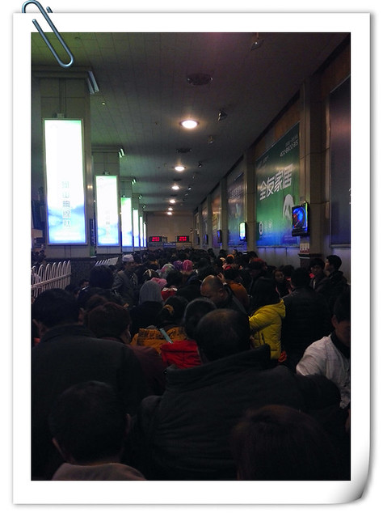

等车时总盼着上车后可以喘口气好好休息一下，而下铺两位陕北口音的老阿姨，等待熄灯后便打开床头小灯，在塑料袋中摸索中两桶方便面开吃了起来，剩下的汤水因为自己喝不下又互相推攘着让对方喝掉，大声聊着家常琐事直到近十二点钟，虽然我们有所示意，她们也没有任何收敛的意识，周围已经十分安静，仿佛整个车厢都是她们的世界，许是大半辈子的生活环境都自在豪洒惯了。

在家待久了总想着走出去看看外面的世界，在外面游逛了数天之后又开始想念家的舒适和温暖。

历时半月，我和hillway圆满完成了此次探亲月郑州、开封和西安三站的旅行计划。

**附：西安五天四夜游费用清单：**

- 火车票：129\*2+178\*2=614元
- 汽车、公交费：25+8+28=61元
- 旅游巴士费：14+14+60\*2+40\*2=228元
- 门票费：120\*2+54+2+100\*2=548元
- 索道费：120\*2=240元
- 租车费：90元
- 住宿费：77+67+49+77=270元
- 餐费：25+32.5+16+22+25.7+4+42+34+26+16+6+16+25.8+3+13.5+20.6+5=333.1元
- 其他：10+5=15元
- 共计：2399.1元
