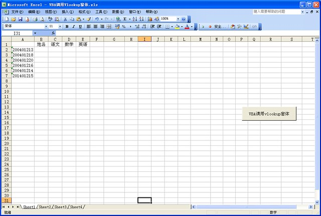
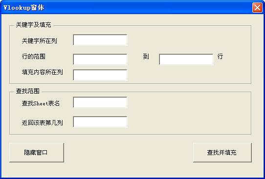
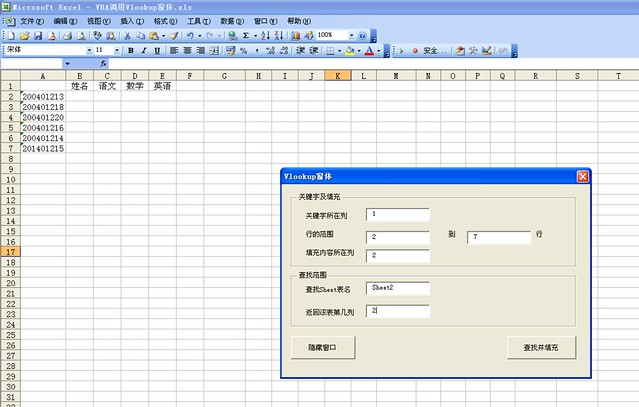

最近使用EXCEL处理数据，总是会用到2张表数据的查找匹配的功能，EXCEL提供了强大的[Vlookup函数](http://www.jfsay.com/archives/763.html)能很好的实现我需要的功能。但是函数在用起来有点麻烦，尤其是在2张表之间切换时很容易会点错参数，而且敲击代码对非程序员很不友好，于是就想找一个VBA窗体实现Vlookup的模板。可是在网上找了好久都没能找到，只能自己动手做一个出来了。

这个VBA实例很简单，也就是把Vlookup进行了改写，提供了用户输入界面的窗体。

先来看下Vlookup函数：VLOOKUP(lookup\_value,table\_array,col\_index\_num,range\_lookup)

翻译过来就是VLOOKUP(查找关键字,查找的范围,返回列,模糊匹配)，需要把这些参数设置为变量，让用户输入即可。

1、 在EXCEL表1中添加一个按钮



2、点击按钮，显示VlookupForm输入窗口



3、输入数据（只需要输入第几列）就可以实现vlookup的功能了



下面简单介绍下代码。模块里面就是按钮单击事件，调用/显示VlookupForm窗口。

```
Sub VlookupSub()
   VlookupForm.Show
End Sub
```

VlookupForm窗体的代码主要还是使用vlookup函数把输入的数据进行处理。

```
Private Sub CommandOK_Click()
Dim RowStart
Dim RowEnd
Dim pp
RowStart = Val(TextStart.Text)
RowEnd = Val(TextEnd.Text)
For m = RowStart To RowEnd
     pp = Application.VLookup(Cells(m, Val(TextKeyword.Text)), Sheets(TextSheet.Text).Range("a:z"), Val(TextReturn.Text), 0)
     If Not Application.IsNA(pp) Then
       Sheets("Sheet1").Cells(m, Val(TextInsert.Text)) = pp
     Else
       '查找不到匹配项，置为0，vlookup默认为N/A
       Sheets("Sheet1").Cells(m, Val(TextInsert.Text)) = 0
     End If
Next m
    
End Sub

Private Sub HideButton_Click()
    VlookupForm.Hide
End Sub
```

整个的实例下载地址：[使用VBA实现Vlookup实例.rar](https://drive.google.com/file/d/0BylPy_4csyrXNUpFd1FZQlZXeFE/view?usp=sharing)
