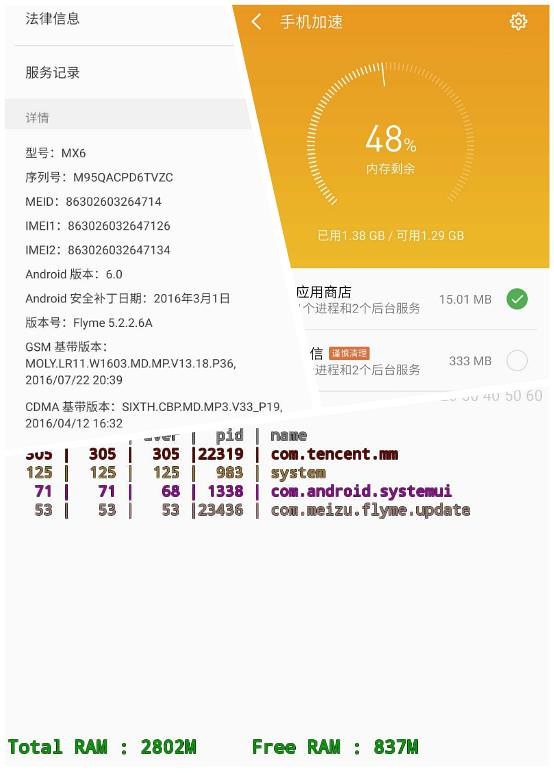
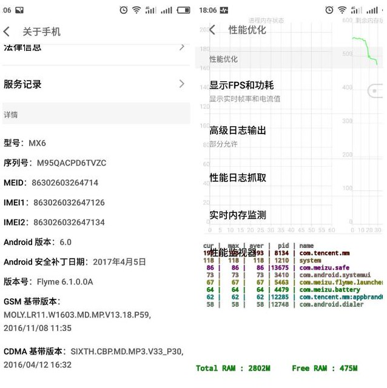
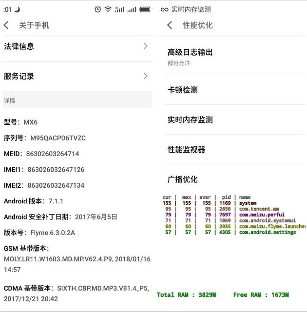

这篇文章的标题自己都不相信，但确实发生了。

我在2017年11月买的手机，到手以后赶紧按推送的更新升级了系统版本，以后每次推送也会及时更新。

用了段时间，想看下手机的运行内存（ram）是多大的，因为系统版本是Flyme6，找不到地方看，后来在网上搜了查看ram的方法，在“设置”-“辅助功能”-“开发者选项”-“性能优化”-“内存监测”里。看到之后吓了一跳3800M多，也就是4G的ram。我赶紧翻出来手机包装盒，明明写的是3G啊。我觉得肯定是显示错了，然后安装了其他的手机硬件检测APP，都是显示4G的ram，我确定手机是4G的了，难道是发错货了？——我赚大了！

之后就没关注ram了，手机用起来也不卡。2019年8月因为[系统升级导致拍照模糊](http://www.jfsay.com/archives/1569.html)，我恢复到了出厂的版本，把系统降到了flyme 5.2.2.6A。拍照效果是好了很多，但是有次在“手机管家”-“手机加速”中发现手机ram“已用”和“可用”加在一起才3G运存。我明明记得一年多前我查的ram是4G啊，现在怎么会是3G，突然想起来手机换过两次外屏，会不会被无耻的商家给换了？上网查找换ram的方法，发现难上加难，ram是焊接在主板上的，要换就要换主板，没人这么干。难道我记错了，也没有留下什么证据，3G就3G吧，当时手机用着不卡，就没管它。

前段时间手机很卡，后台杀进程台严重，过几分钟app就被杀了，用起来很烦。看了下剩余的ram才几百M了，于是上魅族论坛找找难友，惊奇地发现有人说系统升级后ram会增加，好多人说升级后3G的ram变成4G，突然想起一年前我的手机ram也是4G，可能因为降级到flyme5后变成了3G。于是我按着系统推送的更新升级到6.1.0.0A，看了下还是3G的ram，死马当活马医，继续升级到6.3.0.2A，奇迹发生了，“内存监测”有3829的ram了。

出厂版 flyme 5.2.2.6A内存显示3GB，如下所示：

flyme 6.1.0.0A 内存显示3GB，如下所示：

见证奇迹的时刻，继续升级系统到flyme 6.3.0.2A， 内存显示4GB了，如下所示：

