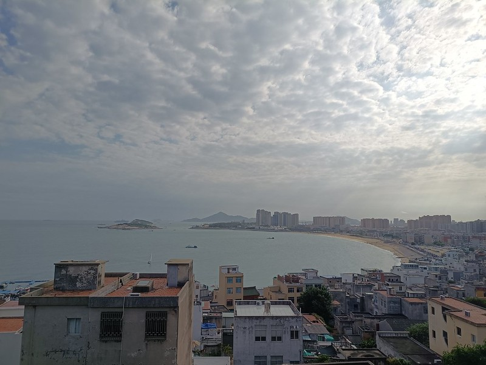

东山岛位于福建漳州的南部，距离汕头只有2小时车程。9月中旬当hillway提议时，我一想到带着两个娃一路“舟车劳顿”，又想到海边景色大同小异，本市有南澳岛、妈屿岛、龙虎滩、北山湾等海滩也可以带娃消遣，没必要舍近求远，兴趣不大。后来又想，本市这些地方去过太多次，已经没有任何新鲜感，也很久没有带着两个娃自驾出游了，换个环境放松下心境也是好的，于是便在网上翻看攻略，计划避开国庆假期，利用周末时间在东山岛待上两天一晚。

我们提前一周在网上预定了9月23号到24号铜陵镇的一家民宿。临近出发时看到关于东山岛周末举办首届铁人三项比赛交通管制的新闻，加之小猪仔在学校被传染鼻塞咳嗽，纠结是否影响出游想取消行程。两个娃听到感觉有些失落，小猪仔兴致勃勃坚持前往，后来我们结合比赛时间调整了具体行程，开启了东山岛两天一夜游。

**第一天：汕头——苏峰山环岛路——苏峰山寺——岩雅古村——金銮湾——马銮湾——铜陵镇夜市**

我们一大早从汕头自驾出发，到达东山岛的第一站是苏峰山环岛路，看网上攻略本以为可以自驾观光，开到入口处被拦停，告知苏峰山环岛路作为景点实行封闭管理，车辆统一开进停车场（停车费每小时3元），需要购买观光车票进入苏峰山环岛路（车票每人10元，无儿童票，或租电动车骑行3小时20元）。hillway觉得来都来了，时间还早，进去逛一逛。

海风挺大，烈日高照，没有任何遮荫处，实在没有骑电动车带着两个娃一路暴晒的勇气，选择了乘坐观光车（四人40元）。看过了N遍南澳环岛路，内心已无任何波澜，有些路段还飘来一股浓郁的腥臭味。我们在苏峰山脚下车，放弃爬山观海，只是逛逛寺庙，然后路边等观光车去下一站，虽然车次密集，但等了很久每车都是满员，后来拦停了一辆打算返程的空车，司机不情不愿但还是掉头拉着我们还有其他6名等车游客前往下一个景点，传说中的岩雅古村。

岩雅古村看上去是废弃的小古村落，除了寺庙旁小卖部，就只有走到尽头在海边岩石能看到游客。小猪仔一看到沙滩海水就特别兴奋，立马脱了鞋子就下水玩沙，完全没有功夫理会拍照，也不肯挪地方。出发时担心两个娃晒黑，给她们包的严严实实，防晒霜防晒帽防晒衣全部“武装整齐”，只露出小腿肚和脚丫，拍照时要穿穿脱脱加上一身汗粘着，也不太乐意配合，连我自己都佩服那些顶着烈日爬上岩石为了拍一张美美照片的游客。环岛路的终点站是蓝色大桥旁边的观景平台，远远可以看到南门湾，仍旧感觉没有什么特色，小猪仔因为没法玩水闹着要走，我们看一看就回去了。

第二站是金銮湾，附近有停车场（每小时5元），走向海滩经过一片树林，听导游说这是当年谷文昌书记带领村民种下的，改变了东山岛寸草不生黄沙漫天的荒凉历史。金銮湾虽然海浪很大，禁止下海游泳，但是海沙很细很软，沙滩很平很宽阔，光着脚丫踩起来很舒服。在现场还未感觉到景色有多美，后面翻看手机里照片，才发现湛蓝的天空和白云，沙滩浅水里人的倒影，拍照效果很好，也很有特色，明白了“镜面沙滩”的由来。打算如果下次再来东山岛，就把住宿订在金銮湾，放慢行程，欣赏风景。

第三站是马銮湾，到达时将近三点，恰好看到小铁人游泳赛的开幕礼炮。马銮湾附近路段有禁停标志，我们初来乍到不熟悉路况，在路边停车迟疑几分钟，手机便收到漳州交警的处罚警告信息。马銮湾的游客比金銮湾多，开发设施也相对完善。本以为比赛会封闭所有海滩，事实上只是圈出一部分，两旁海滩都还可以供游客游玩，不受影响。小猪仔一直迫不及待想下海游泳，担心晒太黑很难恢复，便哄着两个娃在沙滩阴凉处挖沙刨贝壳，一直等到四点多钟给两个娃换上泳衣套上游泳圈。小猪仔平时都是在平静的游泳池中玩水，还没有试过在大海中游泳，加之我在金銮湾反复警告海浪漩涡暗流的危险性，因此也不敢下水太深，后来索性穿着泳衣又在沙滩上玩起沙来。太阳渐渐下山了，海水也凉了，hillway便催促两个娃赶紧回去了。其实海边适合游玩的时间也就一个小时左右。

傍晚六点钟我们抵达铜陵镇的民宿，附近有很多超市餐饮店水果店等，购物很方便。民宿的房间和卫生间的面积超级大，打扫很干净，两张1.5米大床，还有晾衣区和悬挂摇椅。我给两个娃从头到脚全部洗干净，再把两个娃泳衣等清洗一遍晾起来，洗出很多细沙。我们在民宿休息到晚上八点半出来，逛逛铜陵镇夜市，我们晚饭都吃的很饱，hillway给两个娃各买一碗小媳妇甜汤（每份10元）作为夜宵。甜汤琳琅满目的小料不是自选，而是默认每份全加。这家店生意很好，一直在排长队，基本上都是年轻人，有些顾客一次买了10份带走。两个娃吃剩下很多，不喜欢吃里面的红薯和芋头，hillway不吃甜食，都给我了，尝了一口感觉太甜了，简直是甜到“齁”，也可能是我很长一段时间减肥戒糖吃不惯，虽然不应该浪费食物，但是吃进肚子里又要多在健身房运动很久，还是舍弃了……两个娃玩了一天又累又困，从夜市回民宿后刷了牙就秒睡了。

**第二天：南屿双面海——南屿灯塔——南门湾——文公祠——左耳天台——南溟书院——顶街——汕头**

上午十点钟退房，我们从民宿出发，首先去了附近的南屿双面海，潮退后中间形成一片沙滩，比较有特色，两个娃又沉迷于踏浪玩沙不肯走。去南屿灯塔的路上都是海水冲刷的岩石，有些路段是比较难走的乱石堆。感觉远远拍下照片就够了，本来走到一半想放弃，听旁边游客劝说“来都来了”，便跟着大流一直往前艰难行走。半路上hillway牵着走的小猪仔不小心跌倒，膝盖没事，但是左手掌被岩石擦破一点皮（黄豆大小），没有流血，于是我留下来抱着小猪仔撑着伞坐在海边岩石上，hillway带着小熊仔继续前往南屿灯塔。小猪仔闭着眼睛尽情大哭，哭声特别“惨烈”，虽然我们已经习以为常，但引来好多游客围观询问。等小猪仔哭够了情绪宣泄完了，又生龙活虎了。

中午hillway在南门湾附近手机团购了136元海鲜套餐，有东山小管、香辣海蟹（2只）、清蒸/蒜蓉生蚝（10只）、爆炒花蛤、东山头水紫菜鱼丸汤、炒空心菜和米饭。抱着可能踩雷的超低预期进店，没想到每道菜都很新鲜，都很美味，咸淡适中，分量也足，摆满一张大圆桌，我们都吃饱了，直到晚上七点都不觉得肚子饿。店家服务态度也特别好，不存在区别对待团购的情况。我们感觉这里的普通话的普及程度比较高，不像潮汕地区的方言氛围那么浓郁，hillway问路时感觉当地居民也很热情耐心。店面是港式装修风格，二楼有空调雅座和卫生间等，我们一边吃饭一边休息，恢复体力后大概下午两点半离店继续前往南门湾。

南门湾一边是老城民居，一边是半圆形海滩，也算是很有特色的一处景点，两个娃仍旧一路都沉迷于玩水挖沙。东山岛这些景点附近都有停车场，自驾游还是挺方便的，不过听民宿老板说国庆会堵车，旺季建议租电动车。我们按照导航一路走到文公祠和左耳天台，远眺看到上午游玩的南屿双面海，很有成就感。最后逛了逛南溟书院，从顶街走出来，给两个娃在附近麦当劳买了两份汉堡套餐，大家肚子都不饿，只是把饮料喝光了。下午五点钟，我们离开了东山岛，大概傍晚七点钟回到汕头市区。

因时间关系，本次放弃了风动石、渔人码头、鱼骨沙洲、东门屿等景区。

两天的旅游计划完满完成，虽然做了防晒，可能在海滩烈日下游玩时间太久，四个人还是肉眼可见被晒黑了。hillway认为既然出来玩就不能怕晒，因此到最后他也是被晒得最厉害的，黑里透着红、红里泛着肿回家了（后来发现不是“肿”而是实打实的“肉”）。

附携带物品清单：身份证，教师证，手机，充电器，门钥匙、双肩包，抽纸/湿纸巾；防晒衣，太阳伞，太阳帽，防晒霜、护肤水、洗面奶、洗发水，驱蚊水；泳衣，泳帽，泳镜，救生圈，打气筒，浴巾，皮筋，换洗衣服，矿泉水；帐篷、野餐垫（未使用）等。
